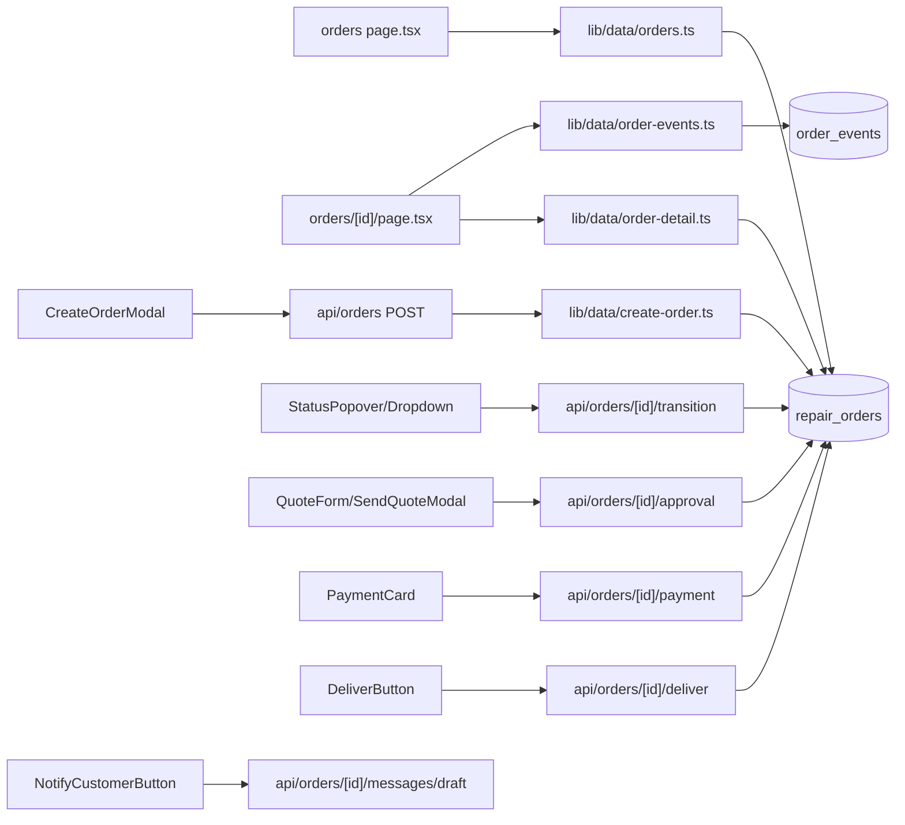

# 工单功能核心文件索引

本文档与仓库 **git 已跟踪版本** 对齐，用于快速 `@` 引用工单（`orders` / `repair_orders`）相关实现。

> **如何确认与 git 一致**：以当前分支 `HEAD` 为准；下列路径均来自 `git ls-files` 所跟踪的文件。若本地有未提交改动，以 `git diff` 为准。

## Git 版本基线（编写时）

- 分支：`cursor/order-macro-partition-a51f`（与远端同名分支同步时，下列路径即该提交上的内容）
- 工单数据主表：`public.repair_orders`（见 [supabase/schema.sql](../supabase/schema.sql)）

## 入口与导航

- [apps/backoffice/src/components/Nav.tsx](../apps/backoffice/src/components/Nav.tsx) — 左侧导航「工单」→ `/orders`

## 页面（App Router）

- [apps/backoffice/src/app/(app)/orders/page.tsx](../apps/backoffice/src/app/(app)/orders/page.tsx) — 工单列表（筛选 + 分组列表）
- [apps/backoffice/src/app/(app)/orders/[id]/page.tsx](../apps/backoffice/src/app/(app)/orders/[id]/page.tsx) — 工单详情（信息、财务、时间线、签名、打印、通知等）

## API 路由

- [apps/backoffice/src/app/api/orders/route.ts](../apps/backoffice/src/app/api/orders/route.ts) — 创建工单 `POST`
- [apps/backoffice/src/app/api/orders/[id]/route.ts](../apps/backoffice/src/app/api/orders/[id]/route.ts) — 更新/删除单个工单
- [apps/backoffice/src/app/api/orders/[id]/transition/route.ts](../apps/backoffice/src/app/api/orders/[id]/transition/route.ts) — 状态流转
- [apps/backoffice/src/app/api/orders/batch-transition/route.ts](../apps/backoffice/src/app/api/orders/batch-transition/route.ts) — 批量状态流转
- [apps/backoffice/src/app/api/orders/[id]/approval/route.ts](../apps/backoffice/src/app/api/orders/[id]/approval/route.ts) — 报价审批
- [apps/backoffice/src/app/api/orders/[id]/payment/route.ts](../apps/backoffice/src/app/api/orders/[id]/payment/route.ts) — 付款登记
- [apps/backoffice/src/app/api/orders/[id]/deliver/route.ts](../apps/backoffice/src/app/api/orders/[id]/deliver/route.ts) — 取件/交付
- [apps/backoffice/src/app/api/orders/[id]/messages/draft/route.ts](../apps/backoffice/src/app/api/orders/[id]/messages/draft/route.ts) — 客户通知草稿
- [apps/backoffice/src/app/api/orders/import/route.ts](../apps/backoffice/src/app/api/orders/import/route.ts) — 导入
- [apps/backoffice/src/app/api/orders/export/route.ts](../apps/backoffice/src/app/api/orders/export/route.ts) — 导出

## 数据访问层（`lib/data`）

- [apps/backoffice/src/lib/data/orders.ts](../apps/backoffice/src/lib/data/orders.ts) — 列表查询、过滤、排序
- [apps/backoffice/src/lib/data/order-detail.ts](../apps/backoffice/src/lib/data/order-detail.ts) — 单工单详情、关联返修单
- [apps/backoffice/src/lib/data/create-order.ts](../apps/backoffice/src/lib/data/create-order.ts) — 创建工单（客户/设备、`public_no` 等）
- [apps/backoffice/src/lib/data/order-events.ts](../apps/backoffice/src/lib/data/order-events.ts) — 工单事件流水（时间线）

## 领域逻辑（`lib/domain` 等）

- [apps/backoffice/src/lib/domain/order-status.ts](../apps/backoffice/src/lib/domain/order-status.ts) — 状态顺序、中文标签、创建允许状态等
- [apps/backoffice/src/lib/order-status.ts](../apps/backoffice/src/lib/order-status.ts) — 状态徽标样式（className）
- [apps/backoffice/src/lib/domain/order-ui-config.ts](../apps/backoffice/src/lib/domain/order-ui-config.ts) — 列表 UI 配置（分组/排序）
- [apps/backoffice/src/lib/domain/order-search.ts](../apps/backoffice/src/lib/domain/order-search.ts) — PostgREST 搜索词处理
- [apps/backoffice/src/lib/domain/order-money.ts](../apps/backoffice/src/lib/domain/order-money.ts) — 报价/订金/尾款/已付逻辑
- [apps/backoffice/src/lib/domain/order-print-it.ts](../apps/backoffice/src/lib/domain/order-print-it.ts) — 打印文案（意大利语等）
- [apps/backoffice/src/lib/domain/fault-types.tsx](../apps/backoffice/src/lib/domain/fault-types.tsx) / [fault-print-it.ts](../apps/backoffice/src/lib/domain/fault-print-it.ts) — 故障分项与价目
- [apps/backoffice/src/lib/domain/adjust-quotation-for-issue.ts](../apps/backoffice/src/lib/domain/adjust-quotation-for-issue.ts) — 故障变更后的报价调整
- [apps/backoffice/src/lib/domain/warranty-calc.ts](../apps/backoffice/src/lib/domain/warranty-calc.ts) — 质保计算
- [apps/backoffice/src/lib/domain/whatsapp.ts](../apps/backoffice/src/lib/domain/whatsapp.ts) — WhatsApp 链接/文案
- [apps/backoffice/src/lib/domain/public-no.ts](../apps/backoffice/src/lib/domain/public-no.ts) — 工单号生成

## UI 组件（`components/orders`）

### 列表 / 搜索

- [apps/backoffice/src/components/orders/OrderGroupedList.tsx](../apps/backoffice/src/components/orders/OrderGroupedList.tsx)
- [apps/backoffice/src/components/orders/OrdersListShell.tsx](../apps/backoffice/src/components/orders/OrdersListShell.tsx) — 列表壳（搜索、分段 Tab、表格、新建订单）
- [apps/backoffice/src/components/orders/OrderListMoneyCell.tsx](../apps/backoffice/src/components/orders/OrderListMoneyCell.tsx)
- [apps/backoffice/src/components/OrderStatusBadge.tsx](../apps/backoffice/src/components/OrderStatusBadge.tsx)

### 详情 / 编辑

- [apps/backoffice/src/components/orders/OrderInfoCard.tsx](../apps/backoffice/src/components/orders/OrderInfoCard.tsx)
- [apps/backoffice/src/components/orders/OrderFormFields.tsx](../apps/backoffice/src/components/orders/OrderFormFields.tsx)
- [apps/backoffice/src/components/orders/EditableRepairCard.tsx](../apps/backoffice/src/components/orders/EditableRepairCard.tsx)
- [apps/backoffice/src/components/orders/OrderTimeline.tsx](../apps/backoffice/src/components/orders/OrderTimeline.tsx)
- [apps/backoffice/src/components/orders/CreateOrderModal.tsx](../apps/backoffice/src/components/orders/CreateOrderModal.tsx)
- [apps/backoffice/src/components/orders/CreateReworkButton.tsx](../apps/backoffice/src/components/orders/CreateReworkButton.tsx)
- [apps/backoffice/src/components/orders/ReworkInfoBanner.tsx](../apps/backoffice/src/components/orders/ReworkInfoBanner.tsx)

### 状态 / 流转

- [apps/backoffice/src/components/orders/StatusDropdown.tsx](../apps/backoffice/src/components/orders/StatusDropdown.tsx)
- [apps/backoffice/src/components/orders/StatusPopover.tsx](../apps/backoffice/src/components/orders/StatusPopover.tsx)
- [apps/backoffice/src/components/orders/DeliverButton.tsx](../apps/backoffice/src/components/orders/DeliverButton.tsx)

### 报价 / 付款

- [apps/backoffice/src/components/orders/QuoteForm.tsx](../apps/backoffice/src/components/orders/QuoteForm.tsx)
- [apps/backoffice/src/components/orders/QuoteFinanceBlocks.tsx](../apps/backoffice/src/components/orders/QuoteFinanceBlocks.tsx)
- [apps/backoffice/src/components/orders/SendQuoteModal.tsx](../apps/backoffice/src/components/orders/SendQuoteModal.tsx)
- [apps/backoffice/src/components/orders/FinanceCard.tsx](../apps/backoffice/src/components/orders/FinanceCard.tsx)
- [apps/backoffice/src/components/orders/PaymentCard.tsx](../apps/backoffice/src/components/orders/PaymentCard.tsx)

### 故障 / IMEI / 扫码

- [apps/backoffice/src/components/orders/FaultSelector.tsx](../apps/backoffice/src/components/orders/FaultSelector.tsx)
- [apps/backoffice/src/components/orders/ImeiImageRecognizer.tsx](../apps/backoffice/src/components/orders/ImeiImageRecognizer.tsx)
- [apps/backoffice/src/components/orders/ImeiRecognizerPicker.tsx](../apps/backoffice/src/components/orders/ImeiRecognizerPicker.tsx)
- [apps/backoffice/src/components/orders/BarcodeScanner.tsx](../apps/backoffice/src/components/orders/BarcodeScanner.tsx)

### 客户通知 / WhatsApp

- [apps/backoffice/src/components/orders/NotifyCustomerButton.tsx](../apps/backoffice/src/components/orders/NotifyCustomerButton.tsx)
- [apps/backoffice/src/components/orders/WhatsAppButton.tsx](../apps/backoffice/src/components/orders/WhatsAppButton.tsx)
- [apps/backoffice/src/components/orders/OrderWhatsAppSendModal.tsx](../apps/backoffice/src/components/orders/OrderWhatsAppSendModal.tsx)

### 签名 / 打印

- [apps/backoffice/src/components/orders/SignatureSection.tsx](../apps/backoffice/src/components/orders/SignatureSection.tsx)
- [apps/backoffice/src/components/orders/SignatureModal.tsx](../apps/backoffice/src/components/orders/SignatureModal.tsx)
- [apps/backoffice/src/components/orders/SignaturePad.tsx](../apps/backoffice/src/components/orders/SignaturePad.tsx)
- [apps/backoffice/src/components/orders/PrintOrderButton.tsx](../apps/backoffice/src/components/orders/PrintOrderButton.tsx)
- [apps/backoffice/src/components/orders/OrderPrintSheet.tsx](../apps/backoffice/src/components/orders/OrderPrintSheet.tsx)
- [apps/backoffice/src/components/orders/OrderDetailPrint.tsx](../apps/backoffice/src/components/orders/OrderDetailPrint.tsx)

### 供应商（外修）

- [apps/backoffice/src/components/orders/SupplierSelect.tsx](../apps/backoffice/src/components/orders/SupplierSelect.tsx)
- [apps/backoffice/src/components/orders/SupplierPickerModal.tsx](../apps/backoffice/src/components/orders/SupplierPickerModal.tsx)
- [apps/backoffice/src/components/orders/SupplierBadge.tsx](../apps/backoffice/src/components/orders/SupplierBadge.tsx)
- [apps/backoffice/src/components/orders/supplier-palette.ts](../apps/backoffice/src/components/orders/supplier-palette.ts)

### UI 配置 Provider

- [apps/backoffice/src/components/order-ui/OrderUiProvider.tsx](../apps/backoffice/src/components/order-ui/OrderUiProvider.tsx)

## 数据库 / Supabase

- [supabase/schema.sql](../supabase/schema.sql) — `repair_orders`、`repair_order_status`、`repair_order_type` 等
- [supabase/rpc-drafts/order_search_repair_orders.sql](../supabase/rpc-drafts/order_search_repair_orders.sql) — 搜索 RPC 草稿

工单相关迁移：

- [supabase/migrations/20260506_unified_flow.sql](../supabase/migrations/20260506_unified_flow.sql)
- [supabase/migrations/20260506_add_new_statuses.sql](../supabase/migrations/20260506_add_new_statuses.sql)
- [supabase/migrations/20260507_add_order_contact_phones.sql](../supabase/migrations/20260507_add_order_contact_phones.sql)
- [supabase/migrations/20260507_add_order_fault_prices.sql](../supabase/migrations/20260507_add_order_fault_prices.sql)
- [supabase/migrations/20260507_add_rework_fields.sql](../supabase/migrations/20260507_add_rework_fields.sql)
- [supabase/migrations/20260507_add_unfixed_pickup_status.sql](../supabase/migrations/20260507_add_unfixed_pickup_status.sql)
- [supabase/migrations/20260507_add_customer_signature.sql](../supabase/migrations/20260507_add_customer_signature.sql)
- [supabase/migrations/20260507_add_store_print_defaults.sql](../supabase/migrations/20260507_add_store_print_defaults.sql)
- [supabase/migrations/20260508_add_order_ui_config.sql](../supabase/migrations/20260508_add_order_ui_config.sql)
- [supabase/migrations/20260509120000_add_mail_in_progress_status.sql](../supabase/migrations/20260509120000_add_mail_in_progress_status.sql)

## 数据流概览

## 备注

- **商品管理（`/inventory`）**、**客户（`/customers`）**、**消息中心** 与工单有关联但各自为独立模块；需要时可单独建索引文档。
- 更新本索引时，建议对照：`git ls-files apps/backoffice/src | grep -E "(orders|order-)"` 与 `git ls-files supabase`。
