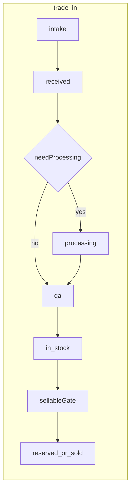
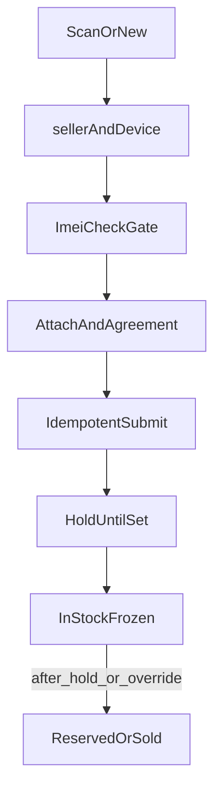
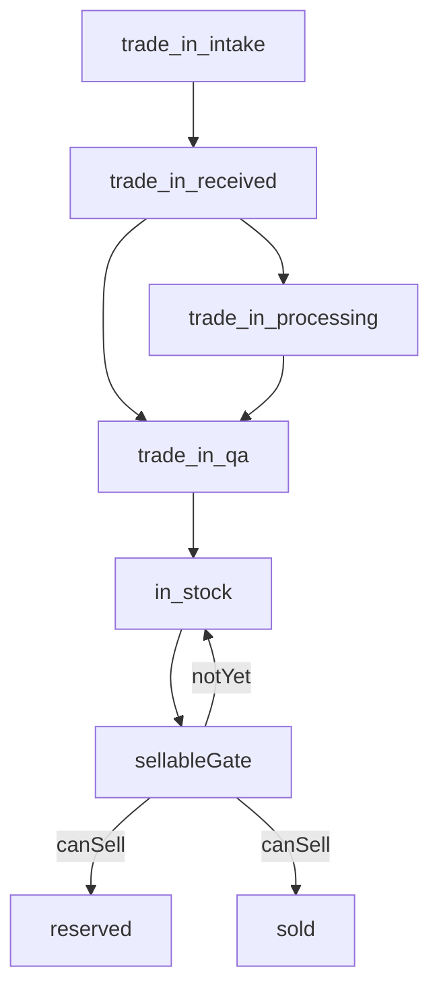

# 商品管理 — 整合完善版实施规划

本文档为仓库内权威版本，汇总商品管理（新机 / 翻新 / 回收）实施规划。技术栈：Next.js 16 单应用 [`apps/backoffice`](apps/backoffice)、Supabase（[`supabase/schema.sql`](supabase/schema.sql) / [`supabase/migrations/`](supabase/migrations/)）；复用 [`BarcodeScanner.tsx`](apps/backoffice/src/components/orders/BarcodeScanner.tsx)、[`order-print-it.ts`](apps/backoffice/src/lib/domain/order-print-it.ts) / [`print-mode.ts`](apps/backoffice/src/lib/domain/print-mode.ts)。**UI 与响应式约束见第 14 节**，须与 [`apps/backoffice/AGENTS.md`](apps/backoffice/AGENTS.md) 一致。

---

## 1. 核心域（简述，与原版一致）

- **`inventory_items`**：`product_channel`（`new_retail` / `refurbished` / `trade_in`）、`lifecycle_status`、`public_no`、`imei_or_serial`、`brand`、`model`、金额与买卖双方客户关联、`store_id`。
- **`trade_in` 专用扩展（建议同一枚举内增收）**：除通用状态外，增加 **`trade_in_intake`**、**`trade_in_received`**、**`trade_in_processing`**（可选）、**`trade_in_qa`**、**`in_stock`**；**「可在售」为派生判定**，见 **第 2.4–2.5 节**。
- **质检数据**：**`qa_report`**（`jsonb`，结构化分项结果 + 缺陷标签，见 **2.5**）；**`qa_completed_at`**（质检流程已提交，≠「全项合格」）；可选 **`condition_grade`**（A/B/C…）由报告派生或手选。
- **派生展示**：**`condition_badges`**（列表/卡片短标签：如屏幕裂、摄像头花）由 `qa_report` 聚合，不必单独持久化或冗余一列亦可。
- **派生字段**：**`is_sellable`** 由 `canSell()` 计算；可选冗余 **`sellable_at`**。
- **`inventory_events`**：对齐 [`order_events`](supabase/schema.sql) 的审计模型。
- **附件**：Supabase Storage + 元数据表或 jsonb（见第 4 节）。

流程示意（回收：合规节点 + 可选整备质检后再进入可售，详见 2.4）：

---

## 2. 新增：运营规则（强烈建议写进 wiki + 代码共用校验）

### 2.1 IMEI / 序列号唯一性与冲突

- **规则需在迁移前定稿**（示例）：同一 `store_id` 下，`lifecycle_status NOT IN ('sold','written_off')` 时 IMEI **唯一**；已售出是否允许相同 IMEI 再次入库由业务决定。
- **冲突时 UX**：入库 API 返回明确错误码 + 已有记录 `id`/`public_no`；前端提供「打开已有记录」「提交纠错/合并申请」（可先人工处理，二期再做审批流）。
- **索引**：部分唯一索引（PostgreSQL 表达式索引或 `WHERE NOT sold` 的唯一约束）需在迁移里写清楚。

### 2.2 必填项矩阵（渠道 × 状态）

- 维护一张 **规则表**（代码常量或 JSON 配置）：例如 `trade_in` 在进入 `in_stock` 前必须有：`seller_customer_id`、协议签字、`checklist_completed`、至少一类身份证明附件（MVP+）。
- **前后端双校验**：在 [`lib/`](apps/backoffice/src/lib/) 抽取 `assertInventoryTransition(from, to, row)`，API `transition` 与表单「下一步」共用，避免只在前端拦。

---

## 2.3 操作逻辑优化（参考补充项 2 / 3 / 7）

以下将先前提议中的 **冷冻期（2）**、**黑名单/IMEI 对照（3）**、**幂等与防重复（7）** 收敛为门店可执行的操作闭环，并与状态机、事件审计对齐。若你方「2.3.7」指外部法规条款，可将条文粘贴到 [`docs/wiki/inventory-domain.md`](docs/wiki/inventory-domain.md) 的合规附录，再微调字段名与勾选项。

### 2.3.1 原则：一条主路径 + 三条横切能力

- **主路径**：列表 / 扫码 → 入库向导 → 详情（状态推进）→ 打印 / 售出。
- **横切**：冷冻期 gates 可售；对照备注满足才可上架；提交与附件上传幂等防双条。

### 2.3.2 冷冻期 / 公示期（对应补充项 2）

- **数据**：`inventory_items` 增加 **`listing_hold_until`**（timestamptz，可空）。入库（尤其 `trade_in`）默认写入「当前时间 + N 天」（N 由 `stores` 扩展参数或常量，如 `trade_in_hold_days`）。
- **规则**：`lifecycle_status = in_stock` 时，若 `now < listing_hold_until`，UI 显示 **「冷冻期内」**，**禁止** 转为 `reserved` / `sold`；按钮禁用并提示剩余天数。可选：允许经理 override（写入 `inventory_events`：`hold_override_reason` + `operator_name`）。
- **操作含义**：店员不需记规则——系统在「售出」动作前自动校验；Dashboard 可加「冷冻期将到期」筛选（MVP+）。

### 2.3.3 黑名单 / IMEI 对照（对应补充项 3）

- **不做全自动 API 前**：详情页 **合规区** 增加固定勾选 + 文本：
  - `imei_check_done`（bool）
  - `imei_check_note`（text，可填登记簿页码、查询站点、接待员备注）
- ** Gate**：`trade_in` 进入 `in_stock` 前建议强制 `imei_check_done === true`（可通过门店配置关闭以适配政策）。事件记入 `inventory_events`。
- **操作含义**：前台流程变为「抄 IMEI → 内部对照 → 勾选完成 → 才允许上架相关动作」，责任可追溯。

### 2.3.4 幂等与防重复（对应补充项 7）

- **入库提交**：客户端生成 **`Idempotency-Key`**（UUID），`POST` 头携带；服务端 24h 内相同 key 返回同一 `inventory_item_id`（内存/DB 映射表二选一，MVP 可用 `(store_id, key)` 唯一约束）。
- **附件上传**：使用 **Storage object name** 含 `inventory_id + content_hash` 或预签名单次 token，避免双击上传重复对象。
- **操作含义**：弱网下店员重复点「保存」不会产生两条库存；纠纷时可查 events。

### 2.3.5 优化后的回收（trade_in）界面顺序（建议）

1. 识别卖方客户（电话）→ 设备品牌型号 IMEI。
2. **IMEI 对照**（勾选 + 备注）→ 通过后才解锁「附件/协议」步骤。
3. 附件与签字 → 合规清单。
4. 提交入库 → 写入 **`listing_hold_until`** → 状态 `in_stock`（冷冻期内 UI 仍标「不可售」）。
5. 冷冻期结束后才允许 **预留 / 售出**（除非经理 override）。

### 2.3.6 分期调整（仅与本节相关）

| 能力 | MVP | MVP+ |
|------|-----|------|
| `listing_hold_until` + 售出前校验 | 建议纳入 | — |
| `imei_check_*` 门禁 | 可选（默认警告不阻断） | 建议可配置阻断 |
| Idempotency-Key | 建议纳入 POST 入库 | 附件去重增强 |

---

## 2.4 回收机：从「回收交接」到「可在售」全流程（本次完善重点）

本节把店员视角阶段、系统状态与 **可售门禁** 一次性对齐；实施时 **`assertInventoryTransition` + 必填矩阵** 必须以本节为准迭代。

### 2.4.1 店员视角阶段（建议文案）

| 阶段 | 含义 | 典型动作 |
|------|------|----------|
| A 交接录入 | 卖方身份、IMEI、附件与协议签字 | 向导步骤见 2.3.5 |
| B 可选整备 | 清洁、账号退出复核、简易维修、解锁等 | 技师操作；不需要则跳过 |
| C 质检分级 | 外观/功能、`condition_grade`、上架备注 | technician；可与拍照归档（MVP+） |
| D 合规冷冻 | `listing_hold_until` 未满则 **不可售** | 系统自动；经理可 override |
| E 可在售 | 满足全部门禁后可 **预留 / 标价展示 / 售出** | frontdesk |

### 2.4.2 推荐状态链（`product_channel = trade_in`）

以下为推荐枚举增量（可与现有 `lifecycle_status` 合并设计，名称仅示意）：

1. **`trade_in_intake`**：草稿或未提交；向导未完成。
2. **`trade_in_received`**：入库记录已创建；**卖方资料、IMEI 对照、协议与清单已满足必填矩阵**（附件 MVP 可先占位）；写入 `listing_hold_until`。**尚未允许售出**。
3. **`trade_in_processing`**（可选）：内部整备中；**不允许**对客户发售；可由 technician 推进。
4. **`trade_in_qa`**：待检测；完成后写入 **`qa_completed_at`** + **`qa_report`**（见 **2.5**）；不再使用「整单不合格即不可售」的狭义 passed。
5. **`in_stock`**：库存可用态；是否 **可在售** 由 **2.4.3 + 2.5** 的 `canSell` 决定。
6. **`reserved` / `sold`**：仅当 **可在售** 为真时允许转入（与新机/翻新共用）。

**跳过整备的路径**：`trade_in_received` →（校验后可直连）→ `trade_in_qa` → `in_stock`。

### 2.4.3 「可在售」判定（sellable gate，建议服务端唯一真相）

定义 **`canSell(row)`**（布尔），全部为真才可 `reserved`/`sold`：

| 条件 | 说明 |
|------|------|
| 合规 | `imei_check_done`（若门店配置为强制） |
| 质检流程已完结 | **`qa_completed_at` 非空**（已走完检测表单并保存）；**允许存在 defect 项**，不要求全绿 |
| 缺陷已披露 | 凡 **`qa_report` 中 `result=defect`** 的项，必须带 **预设标签和/或备注**（`qa_disclosure_complete`，可由服务端根据 `qa_report` 推算）；确保「带病在售」对客户 **可陈述、可打印** |
| 硬阻断（可配置） | 仅当命中门店配置的 **严重项**（例如无法开机、无 IMEI、主板报废）时 **`hard_block`**，`canSell=false`；**普通瑕疵（碎屏、摄像头花等）默认不阻断**，仅通过标签与披露体现 |
| 冷冻期 | `now >= listing_hold_until`，或有效 **`hold_override`** |
| 渠道必填 | 卖方、协议等已由前置 transition 保证 |

列表展示：**`状态`** + **`可售`** + **`condition_badges`**（缺陷摘要，见 2.5）；文案示例：「可售 · 屏幕裂」「冷冻中」「待质检」。

### 2.4.4 与第 2.3 节的关系

- **冷冻期（2.3.2）**：属于 sellable gate 的时间维度。
- **IMEI 对照（2.3.3）**：属于合规维度；可在 `trade_in_received` 前置强制。
- **幂等（2.3.4）**：保障阶段 A 不产生重复库存记录。

### 2.4.5 流程图（回收 → 可售）

### 2.4.6 UI / API 要点

- **详情页分区**：「交接合规」「整备」「质检（分项见 2.5）」「冷冻与可售」卡片 + **底部/侧栏「操作时间线」**（见 **2.6**）；每块只暴露当前允许的 action。
- **`POST .../transition`**：目标状态 + `assertInventoryTransition`；对 `reserved`/`sold` **必须先调用 `canSell`**。
- **列表筛选**：「可售 / 冷冻 / 待质检」+ 可按 **`condition_badges` / grade** 过滤（MVP+）。

### 2.4.7 分期

| 内容 | MVP | MVP+ |
|------|-----|------|
| `trade_in_received` → `trade_in_qa` → `in_stock` 链 | 建议最小可行 | — |
| `trade_in_processing` 状态 | 可选跳过（门店配置「是否启用整备」） | 启用 + 工时备注 |
| `canSell` 完整门禁 | 冷冻期 +（可选）IMEI + qa_completed + 披露 | + 上架照片；hard_block 规则表 |

---

## 2.5 检测流程与缺陷明示（分项功能；不合格仍可售）

### 2.5.1 目标

- 质检覆盖 **多个功能域**（示例）：屏幕、触控、摄像头前/后、Face/Touch ID、扬声器麦克风、充电口、无线与蜂窝、按键、机身外壳、电池健康等。
- 每一项独立记录：**`ok`** | **`defect`** | **`na`**（不适用）| **`not_tested`**（若允许未测则需门店策略：未测是否阻断可售，默认建议 **阻断直至测完或显式标记 na**）。
- **外观/功能瑕疵不默认阻断销售**：只要在 **`qa_report` 中结构化标明**（如屏幕裂、摄像头刮花），并完成披露校验，即可进入 `canSell`。

### 2.5.2 数据：`qa_report`（jsonb）与标签库

- **推荐结构**：按 **类目 `category`**（如 `screen`、`camera_rear`）存 `{ result, label_keys[], note?, metrics? }`；`label_keys` 对齐 **预设枚举**（便于统计与意大利语打印）。
- **标签库**：[`lib/domain/inventory-qa-labels-it.ts`](apps/backoffice/src/lib/domain/)（示意路径）维护 **`key → 意大利语展示名`**（如 `screen_crack` → 「Vetro rotto / crepa」、`camera_lens_scratch` → 「Graffi obiettivo」）；后台中文表单可选并行显示。
- **`condition_grade`**：可由规则从 defect 数量/严重度派生（A/B/C），或手工选择；与 badges 一并用于列表筛选。

### 2.5.3 展示与打印

- **详情**：质检卡片展示 **分项表 + 已选缺陷标签**；顶部 **badge 条** 汇总痛点。
- **列表**：在卡片角标/副标题显示 **1～3 个 condition_badges**，过长折叠。
- **销售小票（IT）**：增加固定区块 **「Difetti / Condizioni dichiarate」**，列出意大利语标签 + 自由备注；与工单 [`OrderPrintSheet`](apps/backoffice/src/components/orders/OrderPrintSheet.tsx) 同样面向客户可读。

### 2.5.4 与状态 `trade_in_qa` → `in_stock`

- 技师提交质检即写入 **`qa_completed_at`** + **`qa_report`**，并触发 **`inventory_events`**（见 2.6）；transition 到 **`in_stock`** 的前提是 **质检表单校验通过**（含披露完整），而非「无 defect」。

---

## 2.6 操作时间线与历史（inventory_events + Timeline UI）

### 2.6.1 事件模型（对齐 `order_events`）

- **表**：[`inventory_events`](supabase/schema.sql)（规划）：`store_id`、`inventory_item_id`、`event_type`（text）、`payload`（jsonb）、`operator_name`、`created_at`。
- **建议 `event_type` 枚举**（持续扩展）：`created`、`status_changed`、`qa_saved`、`defect_updated`、`processing_started`、`processing_done`、`attachment_added`、`print_receipt`、`print_trade_in_agreement`、`hold_override`、`listing_ready`、`reserved`、`sold`、`price_changed`、`internal_note`、`customer_linked` 等。
- **payload 最小约定**：`status_changed` 带 `from`、`to`；`qa_saved` 带 `qa_report` 摘要或 hash + 变更字段名；`print_*` 带 `template_version`。

### 2.6.2 写入策略（必须）

- 任意 **transition**、**PATCH 质检**、**附件上传**、**打印**、**备注**、**价格变更**，成功后 **插入一条 event**（与工单写 `order_events` 同一纪律）。
- 服务端集中 **`appendInventoryEvent()`**，避免漏写。

### 2.6.3 UI

- 新增 **[`InventoryTimeline.tsx`](apps/backoffice/src/components/inventory/InventoryTimeline.tsx)**（示意）：布局、字号、`it-IT` 短时间与 [`OrderTimeline.tsx`](apps/backoffice/src/components/orders/OrderTimeline.tsx) **对齐**，保证后台体验一致；事件图标映射 `event_type` → 图标组件（沿用 [`icons.tsx`](apps/backoffice/src/components/icons.tsx) 规范，禁用 emoji）。

### 2.6.4 分期

| 内容 | MVP | MVP+ |
|------|-----|------|
| 核心 event 类型 + Timeline 只读 | `created`、`status_changed`、`qa_saved`、`print_*`、`sold` | 余下类型与筛选 |
| 详情页嵌入 Timeline | 是 | 时间线筛选、导出 PDF |

---

## 3. 新增：与维修工单的弱关联

- 在 `inventory_items` 增加可选 **`source_repair_order_id`** → [`repair_orders`](supabase/schema.sql)，用于翻新机来源追溯。
- UI：翻新入库表单可选「关联工单」搜索（按 `public_no` / 电话，复用工单列表查询模式）。

---

## 4. 新增：合规与隐私（字段级）

| 能力 | 建议实现 |
|------|----------|
| 模板版本 | 协议/小票正文常量或 DB；字段 **`legal_template_version`** + **`legal_template_effective_at`**；每次打印写入 `inventory_events` payload |
| 文档保留 | 字段 **`document_retention_until`**（或策略 ID + 计算）；到期任务二期可做「提醒 + 批量匿名化」 |
| 敏感附件 | Storage path + kind；**列表 API 对 `frontdesk` 脱敏**（隐藏证件 URL 或返回占位），`manager` 全量（见第 8 节） |

GDPR 与意大利二手法规：**仍须本地法务确认**；系统只提供字段与审计链。

---

## 5. 打印与审计增强（并入 MVP / MVP+）

- **双联打印**：同一 `PrintSheet` 增加「客户联 / 商家留存联」标识或连续两页；或使用两次 `triggerOrderSheetPrint` 提示用户打印两份 —— 实施时选一种并写入 [`print-mode.ts`](apps/backoffice/src/lib/domain/print-mode.ts) 扩展或文档。
- **打印存档**：每次打印记录 `inventory_events`：`print_kind`、`template_version`、`operator_name`、`printed_at`（便于争议举证）。
- **PDF 导出（可选 MVP+）**：浏览器打印为 PDF 即满足多数门店；若需服务端 PDF，列为二期。

---

## 6. 扫码：多格式解析

在列表/入库共用一小段 **解析工具函数**（[`lib/domain/`](apps/backoffice/src/lib/domain/) 或 `lib/inventory/scan-parse.ts`）：

- 纯数字 / IMEI 格式。
- 内部 `public_no`（如 `MI-I250507-001` 类比工单前缀）。
- **URL**：解析路径末段 `uuid` 或 `public_no`（与详情路由约定一致）。
- GS1 / 包装条码：尽力解析；无法识别时落于搜索框由人工处理。

继续复用 [`BarcodeScanner.tsx`](apps/backoffice/src/components/orders/BarcodeScanner.tsx)，仅在回调处统一走解析函数。

---

## 7. 报表与导出

- **库存台账 / 回收台账**：`GET /api/inventory/export` 或扩展 pattern 对齐 [`orders/export`](apps/backoffice/src/app/api/orders/export/route.ts)（CSV + `it-IT` 日期列）。
- 筛选：`store_id`、日期区间、`product_channel`、状态；回收导出含 IMEI、卖方摘要（脱敏规则与详情一致）。
- **可选列**：`condition_badges` 或 `qa_report` 折叠摘要（缺陷关键字），便于盘点「有问题在售」机器。

---

## 8. 权限与脱敏

- 沿用现有角色 **`frontdesk` / `technician` / `manager`**（见 [`domain-model.md`](docs/wiki/domain-model.md)）。
- **建议**：`frontdesk` 查看回收记录时隐藏身份证号全文、证件下载链接；`manager` 完整。**实现要点**：详情 API 分支返回 DTO，勿仅靠前端隐藏。

---

## 9. 二期（明确不做进 MVP）

- **弱网离线**：签名/拍照本地队列与重试。
- **IMEI 黑名单第三方 API**。
- **翻新 BOM 结构化**、**SDI 电子发票直连**。

---

## 10. 分期调整（合并补充后的建议）

| 阶段 | 范围 |
|------|------|
| **MVP** | 菜单 [`Nav.tsx`](apps/backoffice/src/components/Nav.tsx)；`inventory_items` + `inventory_events`；列表/详情/向导；三种渠道表单；transition + 必填矩阵；IMEI 冲突；意大利语销售小票（含 **dichiarati difetti**）；扫码；**InventoryTimeline**；**第 2.5 节**：分项质检 + `qa_report` + badges + 带病可售披露；**第 2.4 节**：回收链、`canSell`（含 hard_block 占位）；**第 2.3 节**：冷冻、`Idempotency-Key`、向导 2.3.5；**第 14 节**：UI 统一与移动/桌面适配验收 |
| **MVP+** | Storage 与附件；回收协议打印 + 签字；**打印事件存档**；**双联打印**；**导出 CSV**；**证件类脱敏权限**；`document_retention_until` / 模板版本写入事件 |
| **二期** | 离线队列、黑名单 API、发票对接、PDF 服务端、审批合并流 |

---

## 11. 给你们的额外建议（实施优先级）

1. **先冻结 `public_no` 生成规则**（与工单 [`repair_orders.public_no`](supabase/schema.sql) 同一生成服务风格），避免后期扫码与印刷物料作废。
2. **必填矩阵文档化**：在 [`docs/wiki/inventory-domain.md`](docs/wiki/inventory-domain.md) 用表格列出渠道 × 状态 × 字段，与代码常量单一来源（或生成）。
3. **打印前先预览**：与工单一致，减少废纸与客户纠纷。
4. **大事记**：回收单日附件体积可能很大，上传前前端压缩图片（不改后端也可先做）。

---

## 12. 关键文件（在原清单上增补）

- 新：`lib/inventory/transition-rules.ts`、`lib/inventory/sellable.ts`（`canSell`）、`lib/inventory/scan-parse.ts`、`lib/inventory/append-event.ts`、`lib/domain/inventory-qa-labels-it.ts`（标签 i18n）
- 新：`components/inventory/InventoryTimeline.tsx`、`components/inventory/QaChecklistForm.tsx`（示意）
- 新：`app/api/inventory/export/route.ts`（若采用）
- 改：详情 / API 返回 DTO 脱敏逻辑
- **规范**：[`apps/backoffice/AGENTS.md`](apps/backoffice/AGENTS.md)（Mobile First、Modal、列表双视图、图标）
- 文档：[`docs/wiki/inventory-domain.md`](docs/wiki/inventory-domain.md)（必填矩阵 + 状态机 + IMEI 规则）

---

## 13. 风险（沿用并补充）

- **唯一约束与历史数据**：若存在「无 IMEI 入库」，需允许 null 且多条 null 的策略要想好。
- **脱敏与审计**：经理导出全量时需同样记录在 `inventory_events`。
- **带病在售纠纷**：若小票/协议未打印缺陷摘要即售出，法律风险高；**打印前校验 `qa_report` 同步到票据**（MVP 即约束）。
- **hard_block 规则**：需在 wiki 写明并由店长配置，避免店员误解「有瑕疵却不能卖」。

---

## 14. UI 统一与响应式（桌面端 / 移动端）

本节为商品模块 **强制约束**，与全局后台规范一致，避免「库存页看起来像另一个产品」。

### 14.1 统一性原则

- **唯一规范来源**：[`apps/backoffice/AGENTS.md`](apps/backoffice/AGENTS.md) 中的 UI 章节——Mobile First、设计 Token（`bg-surface` / `bg-surface-2`、`border-border`、`ui-btn`、`ui-input`、`ui-panel`）、Modal（移动端底部抽屉 / 桌面居中，`bg-black/35` 遮罩）、**禁止全屏白遮罩**。
- **与工单模块对齐**：列表与详情的信息密度、卡片圆角、分隔方式应对齐 [`OrderGroupedList.tsx`](apps/backoffice/src/components/orders/OrderGroupedList.tsx)、[`CreateOrderModal.tsx`](apps/backoffice/src/components/orders/CreateOrderModal.tsx)、[`OrderTimeline.tsx`](apps/backoffice/src/components/orders/OrderTimeline.tsx)；壳层统一使用 [`AppShell.tsx`](apps/backoffice/src/components/AppShell.tsx) + [`Nav.tsx`](apps/backoffice/src/components/Nav.tsx)。
- **状态与徽章**：渠道、`lifecycle_status`、`condition_badges`、可售/冷冻等，采用与工单 **同类 Badge 模式**（颜色由 `lib/` 映射 class，参考 `OrderStatusBadge` 思路），禁止页面内随意硬编码色值。
- **图标**：仅用 [`icons.tsx`](apps/backoffice/src/components/icons.tsx) 线条图标；**禁用 emoji 作图标**。

### 14.2 响应式布局（商品模块专用表）

| 场景 | 移动端（默认～`<lg`） | 桌面端（`lg+`） |
|------|----------------------|------------------|
| 库存列表 | 卡片列表 `space-y-3`，`ui-panel` 或 `rounded-xl border border-border bg-surface-2 p-3` | `hidden lg:block` 表格 + `overflow-x-auto`（列表视图规范见 AGENTS） |
| 筛选栏 | 纵向堆叠；必要时 `sticky` 顶部 | `sm:flex-row` 工具栏横排 |
| 入库向导 | 纵向步骤 / 底部固定主按钮；Modal 用抽屉式（`items-end` → `md:items-center`） | `md:max-w-2xl` 面板；表单可用 `lg:grid-cols-2` |
| 质检表单 | 分项用 **Accordion** 或单列，避免横向滚动 | `xl:grid-cols-2` 或左侧类目导航 + 右侧内容 |
| 详情页 | 区块纵向堆叠 | 可选 `lg:grid-cols-[minmax(0,1fr)_380px]`：主内容 + 侧栏 Timeline（MVP+） |
| 扫码 | 与工单一致：醒目按钮唤起 [`BarcodeScanner`](apps/backoffice/src/components/orders/BarcodeScanner.tsx) | 紧凑图标按钮即可 |

### 14.3 触控与可用性

- **最小点击区域**：移动 **40×40px**，桌面输入高度 **`md:h-9`**（见 AGENTS 尺寸表）。
- **打印**：沿用 [`PrintOrderButton`](apps/backoffice/src/components/orders/PrintOrderButton.tsx) / `triggerOrderSheetPrint` 流程；打印前预览。

### 14.4 验收清单（开发自测）

- [ ] 宽度 **375px** 与 **1280px** 各完成一次完整路径：列表 → 新建 → 质检保存 → 详情时间线 → 打印预览。
- [ ] 无 `bg-white` 全屏 Modal；列表在 `<lg` 仅为卡片、**不出现横向滚动表格**。
- [ ] 同一页面内按钮层级：`ui-btn-primary` 唯一主操作。

### 14.5 分期

| 内容 | MVP | MVP+ |
|------|-----|------|
| AGENTS 断点 + Token + 列表双视图 | 强制 | — |
| 详情 Timeline 双栏（侧栏固定） | 可选单列 | 推荐双栏 |
