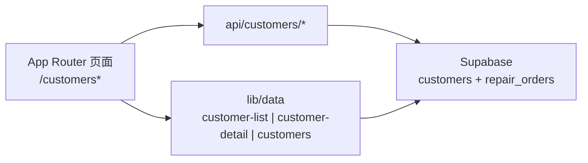

# 客户功能核心文件索引（供开发与 Chat 引用）

## 架构关系（简要）

- **列表页**通过服务端 [`apps/backoffice/src/lib/data/customer-list.ts`](../../apps/backoffice/src/lib/data/customer-list.ts) 直接查 `customers` + `repair_orders` 聚合统计（工单数、消费、最近工单与状态）。
- **新建/编辑**走 [`apps/backoffice/src/app/api/customers/route.ts`](../../apps/backoffice/src/app/api/customers/route.ts) 与 [`apps/backoffice/src/app/api/customers/[id]/route.ts`](../../apps/backoffice/src/app/api/customers/[id]/route.ts)。
- **自动完成**走 [`apps/backoffice/src/app/api/customers/suggest/route.ts`](../../apps/backoffice/src/app/api/customers/suggest/route.ts) + [`apps/backoffice/src/lib/data/customers.ts`](../../apps/backoffice/src/lib/data/customers.ts)（`suggestCustomers`）。

---

## 1. 前端页面（App Router）

| 路由 | 文件 |
|------|------|
| `/customers` 列表（标题、搜索、筛选、卡片/表格） | [`apps/backoffice/src/app/(app)/customers/page.tsx`](../../apps/backoffice/src/app/(app)/customers/page.tsx) |
| `/customers/new` 新建客户 | [`apps/backoffice/src/app/(app)/customers/new/page.tsx`](../../apps/backoffice/src/app/(app)/customers/new/page.tsx) |
| `/customers/[id]` 客户详情（设备、工单列表等） | [`apps/backoffice/src/app/(app)/customers/[id]/page.tsx`](../../apps/backoffice/src/app/(app)/customers/[id]/page.tsx) |

侧边栏入口：[`apps/backoffice/src/components/Nav.tsx`](../../apps/backoffice/src/components/Nav.tsx)（`/customers` →「客户」）。

---

## 2. UI 组件（`components/customers/`）

- [`CustomerSearch.tsx`](../../apps/backoffice/src/components/customers/CustomerSearch.tsx) — 搜索 `q`、筛选 `filter`（与列表页 `searchParams` 对齐）。
- [`CustomerPagination.tsx`](../../apps/backoffice/src/components/customers/CustomerPagination.tsx) — 分页。
- [`CustomerInfoCard.tsx`](../../apps/backoffice/src/components/customers/CustomerInfoCard.tsx) — 详情页客户信息卡片。
- [`CustomerActions.tsx`](../../apps/backoffice/src/components/customers/CustomerActions.tsx) — 详情页操作。
- [`DeviceCard.tsx`](../../apps/backoffice/src/components/customers/DeviceCard.tsx) — 设备卡片。

列表「最近工单状态」徽章（与工单模块共用）：[`apps/backoffice/src/components/OrderStatusBadge.tsx`](../../apps/backoffice/src/components/OrderStatusBadge.tsx)。

---

## 3. 数据访问层（`lib/data/`）

| 职责 | 文件 |
|------|------|
| 列表查询、聚合工单统计、筛选「进行中/最近工单」 | [`customer-list.ts`](../../apps/backoffice/src/lib/data/customer-list.ts) |
| 详情、设备列表、客户名下工单 | [`customer-detail.ts`](../../apps/backoffice/src/lib/data/customer-detail.ts) |
| 客户联想/搜索建议（供下单等场景） | [`customers.ts`](../../apps/backoffice/src/lib/data/customers.ts)（`suggestCustomers`） |

---

## 4. HTTP API（`app/api/customers/`）

- [`route.ts`](../../apps/backoffice/src/app/api/customers/route.ts) — **POST** 创建客户（手机号规范化、重复校验等）。
- [`[id]/route.ts`](../../apps/backoffice/src/app/api/customers/[id]/route.ts) — **PATCH** 更新、**DELETE** 软删除（以文件内实现为准）。
- [`suggest/route.ts`](../../apps/backoffice/src/app/api/customers/suggest/route.ts) — 联想接口（通常委托 `suggestCustomers`）。
- [`[id]/devices/route.ts`](../../apps/backoffice/src/app/api/customers/[id]/devices/route.ts) — 客户设备集合。
- [`[id]/devices/[deviceId]/route.ts`](../../apps/backoffice/src/app/api/customers/[id]/devices/[deviceId]/route.ts) — 单设备更新/删除等。

---

## 5. 数据库与迁移

- **表结构定义（customers、devices、repair_orders 外键）**：[`supabase/schema.sql`](../../supabase/schema.sql)（`customers` / `devices` / `repair_orders`）。
- **增量迁移**：
  - [`supabase/migrations/20260507_dedupe_customers_unique_phone.sql`](../../supabase/migrations/20260507_dedupe_customers_unique_phone.sql) — 门店 + `phone_e164` 唯一约束与去重。
  - [`supabase/migrations/20260507_add_customer_signature.sql`](../../supabase/migrations/20260507_add_customer_signature.sql) — 工单表字段（与客户签名相关，非客户表本体）。
- 运维脚本（可选）：[`scripts/apply-customer-dedupe-migration.sh`](../../scripts/apply-customer-dedupe-migration.sh)。

---

## 6. 文档与其它交叉引用

- 接口纲要 **§4 Customers**：[`api-outline.md`](./api-outline.md)。
- Dashboard 快捷入口与客户名展示：[`apps/backoffice/src/app/(app)/dashboard/page.tsx`](../../apps/backoffice/src/app/(app)/dashboard/page.tsx)。
- 工单创建/导入等若需关联客户：`CreateOrderModal`、`scripts/import-legacy-xlsx.ts`（扩展关联，非客户模块内核）。

---

## 使用建议

- 讨论「客户列表筛选逻辑」：优先 [`customer-list.ts`](../../apps/backoffice/src/lib/data/customer-list.ts) 与 [`customers/page.tsx`](../../apps/backoffice/src/app/(app)/customers/page.tsx)。
- 讨论「新建客户校验」：对齐 [`api/customers/route.ts`](../../apps/backoffice/src/app/api/customers/route.ts) 与 [`supabase/schema.sql`](../../supabase/schema.sql) 中 `customers` 表字段。
