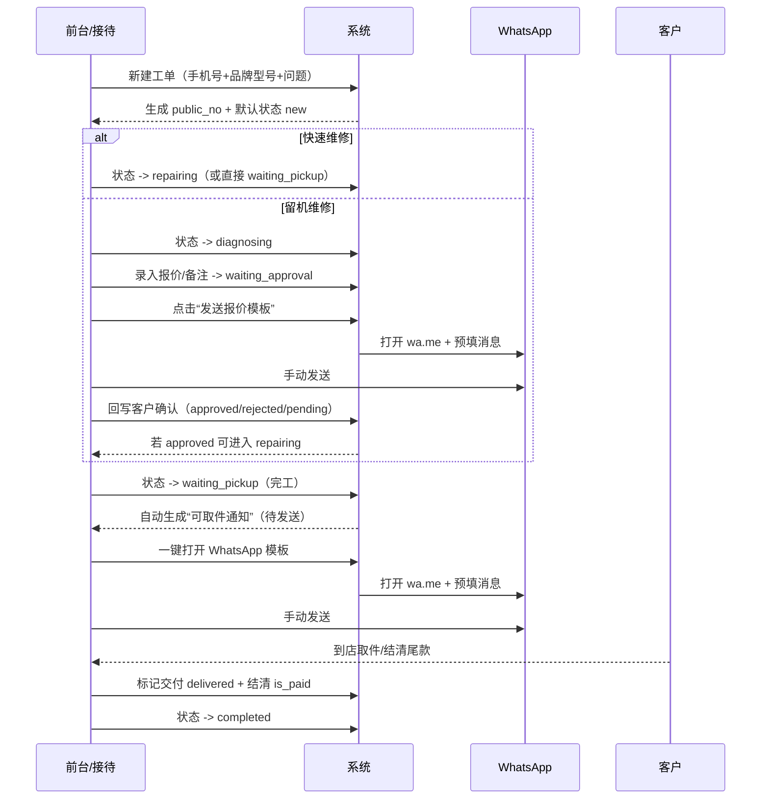

# 后台页面原型结构图（MVP）

适用范围（已确认）：
- 第一阶段做门店内部后台（MVP）
- 数据结构按“多门店预埋”设计（核心对象需要可按门店隔离）
- 工单对客短号 `public_no` 采用 **店号 + 日期 + 序号**（例：`MI-R250506-001`）
- 工单流程：**双轨模式**（快速维修简流程 / 留机维修标准流程）

本文目标：
- 用“页面层级 + 页面区块 + 关键操作 + 跳转关系”把后台原型骨架定死
- 让你后续做 Figma / 低保真原型 / 开发拆任务时直接可用

---

## 1. 信息架构（Sitemap）

> 说明：左侧是模块，右侧是页面。括号内为建议的意大利语菜单名（可后续调整）。

```mermaid
flowchart TD
  A[登录 / 门店选择] --> B[工作台 Dashboard]

  B --> OList[工单列表 (Ordini/Riparazioni)]
  OList --> ODetail[工单详情 (Ordine)]
  ODetail --> OEdit[工单编辑/补录 (Modifica)]

  B --> CList[客户列表 (Clienti)]
  CList --> CDetail[客户详情 (Cliente)]

  CDetail --> DInline[设备区块 (Dispositivi)]
  DInline --> DDetail[设备详情/历史 (Dispositivo)]

  B --> MsgCenter[消息中心 (Messaggi)]
  MsgCenter --> Tpl[模板库 (Template)]
  MsgCenter --> MsgLog[发送记录 (Registro)]

  B --> Settings[设置 (Impostazioni)]
  Settings --> Store[门店信息 (Negozio)]
  Settings --> Users[账号与角色 (Utenti/Ruoli)]
  Settings --> Dict[字典/选项 (Campi/Valori)]
  Settings --> Autom[自动化参数 (Automazioni - MVP)]
```

---

## 2. 关键业务路径（从“能用”到“好用”）

### 2.1 路径 P0：接待建单 → 跟进 → 通知 → 交付完成



### 2.2 路径 P0：工作台的“待办驱动”

工作台（Dashboard）需要给员工一个“今天先处理什么”的入口，至少 4 块卡片：
- 待客户确认报价（超 48 小时高亮）
- 待取件（含超期未取件：完工后第 5 天开始高亮）
- 缺件/等待（MVP 先靠手工标识 pause_reason=缺件）
- 今日新增/今日完工（便于当班交接）

---

## 3. 页面级原型结构（每页区块与关键交互）

> 原则：**列表秒搜，详情强操作，时间线可追溯**。

### 3.1 登录 / 门店选择

**页面目的**：多门店预埋的前提，用户登录后明确当前门店上下文。

区块：
- 登录表单（账号/密码）
- 门店选择（若用户仅绑定一个门店可自动进入）

关键交互：
- 切换门店（顶部全局入口）

---

### 3.2 工作台 Dashboard

区块（建议）：
1) **全局搜索框（置顶）**
   - 支持：电话、姓名、工单号、IMEI、品牌型号、问题关键词
2) **待办卡片**
   - 待确认报价（>48h）
   - 待取件（>5天高亮）
   - 今日新增/今日完工
3) **快捷操作**
   - 新建工单（主 CTA）
   - 新建客户（可选）

关键交互：
- 从待办卡片一键跳到“工单详情”并定位到需要处理的动作区

---

### 3.3 工单列表（Ordini / Riparazioni）

#### 列表默认列（建议）
- 状态徽标（new / diagnosing / waiting_approval / repairing / waiting_pickup / completed / cancelled）
- 工单号 `public_no`
- 客户（姓名/电话）
- 设备（品牌/型号/IMEI）
- 问题描述（截断 + 悬浮全文）
- 金额（总价/订金/尾款）
- 技师
- 创建日期 / 预计取件 / 完工时间

#### 搜索与筛选（MVP 必须）
搜索（一个框）：电话、姓名、工单号、IMEI、品牌型号、问题关键词、技师

筛选器（左侧或顶部）：
- 门店（多门店预埋：默认当前门店，可切换）
- 工单类型：快速维修 / 留机维修
- 状态
- 技师
- 是否结清
- “待确认超时”（>48h）
- “超期未取件”（>5天）
- 日期范围：创建日期 / 完工日期

#### 行内快捷动作（建议）
- 打开工单详情
- 快速改状态（受权限控制）
- 一键 WhatsApp（打开模板选择）

---

### 3.4 新建工单（推荐用抽屉 Drawer / Modal）

你已确认的 **必填**：
- 手机号
- 品牌
- 型号
- 问题描述

结构（4 分区）：
1) 客户：手机号、姓名（非必填）
2) 设备：品牌、型号、IMEI（非必填）
3) 工单：类型（快速/留机）、问题描述、内部标记、技师（可选）
4) 金额：预计总价、订金（可选）

关键交互：
- 输入手机号后：自动提示已有客户与历史工单数量
- 选择“留机维修”时：详情页会出现“检测/报价/确认”动作区（而非建单时强制录入）

---

### 3.5 工单详情（Ordine）

建议布局：**顶部摘要 + 5 个信息区块 + 时间线**。

#### A. 顶部摘要（固定在顶部）
- 状态徽标 + 状态变更按钮（权限控制）
- 工单号 `public_no`
- 门店（store）
- 工单类型（快速/留机）
- 客户姓名 + 电话 + WhatsApp 快捷按钮
- “当前待办提示”（例如：待客户确认报价 / 超期未取件）

#### B. 客户卡片
- 姓名、电话、语言偏好（可选）
- 同意状态（必要通知/营销）
- 历史工单数量（点击可筛出该客户所有工单）

#### C. 设备卡片
- 品牌、型号、IMEI/序列号
- 备注（可选）

#### D. 维修卡片（核心）
- 问题描述（必填）
- 检测结论（留机维修才显示/强使用）
- 内部标记、保修信息
- 技师

动作（根据状态与类型动态显示）：
- **留机维修 + diagnosing**：填写检测结论、录入报价 → 进入 waiting_approval
- **waiting_approval**：
  - 生成并发送报价模板（打开 wa.me）
  - 回写客户确认结果：approved / rejected / pending
  - approved 后允许进入 repairing
- **repairing**：维修备注、标记完工 → 进入 waiting_pickup
- **waiting_pickup**：标记已取件/交付（delivered）

#### E. 付款卡片（订金 + 尾款）
- 报价/总价（quotation_amount）
- 订金（deposit_amount）
- 尾款（balance_amount 自动计算）
- 是否结清（is_paid）+ 结清时间

#### F. 消息卡片（MVP 重点：留痕）
- 模板选择下拉（报价/可取件/催取件/缺件到货）
- 一键打开 WhatsApp（wa.me + 预填）
- 发送记录列表（含：模板、内容、操作人、时间、状态）

#### G. 时间线（Timeline）
必须记录的事件：
- 创建工单
- 状态变更（含操作者）
- 报价发送（含模板与内容快照）
- 客户确认结果回写
- 完工时间
- 取件/交付时间
- 结清时间

---

### 3.6 客户列表（Clienti）

目的：用客户维度快速定位“电话一响就能找到全部历史”。

列表列建议：
- 客户名（可空）
- 电话（主索引）
- 最近工单日期
- 工单总数
- 当前是否有未完成工单（徽标）

关键交互：
- 输入电话直接定位客户
- 一键进入客户详情

---

### 3.7 客户详情（Cliente）

区块：
- 客户资料（含同意状态）
- 设备列表（可直接新建/编辑）
- 工单历史（可按状态筛选）
- 消息时间线（按工单聚合展示）

---

### 3.8 消息中心（Messaggi）

MVP 建议拆 2 个子页：

1) 模板库（Template）
- 模板类型：报价、可取件、催取件、缺件到货
- 变量预览：{nome} {marca} {modello} {public_no} {totale} {acconto} {saldo} 等
- 支持 IT/EN 双语（先可只做 IT，结构预留）

2) 发送记录（Registro）
- 可按：日期、门店、操作人、模板类型、关联工单筛选
- 用于纠纷追溯（“我什么时候通知过你”）

---

### 3.9 设置（Impostazioni）

MVP 必要子页：
- 门店信息（地址、营业时间、地图链接、门店短号 store_code）
- 账号与角色（前台/技师/店长）
- 字典/选项（技师名单、内部标记、保修选项等）
- 自动化参数（本次已确认：48h 报价提醒、5 天未取件提醒）

---

## 4. 组件与交互约定（避免后续反复）

### 4.1 状态徽标与颜色

建议约定（便于员工一眼识别）：
- new：灰
- diagnosing：蓝
- waiting_approval：橙
- repairing：紫/蓝紫
- waiting_pickup：绿（但“未结清”可加黄点提示）
- completed：深绿/灰绿
- cancelled：红/灰红

### 4.2 快捷发送 WhatsApp 的统一入口

所有出现客户电话的地方（工单详情顶部、客户详情、列表行内）都应提供：
- WhatsApp 按钮（打开 wa.me）
- 并允许选择模板（或默认使用最常用模板）

### 4.3 “待办提示”的计算口径（MVP）

- 待确认超时：状态=waiting_approval 且 now - approval_sent_at > 48h
- 超期未取件：状态=waiting_pickup 且 now - completed_at > 5 天

---

## 5. 下一步（我建议）

你确认后，我会继续产出下一份文档：
- **数据库表结构草案（多门店预埋版）**：字段类型、索引、唯一约束、外键关系、关键枚举值与迁移建议。
